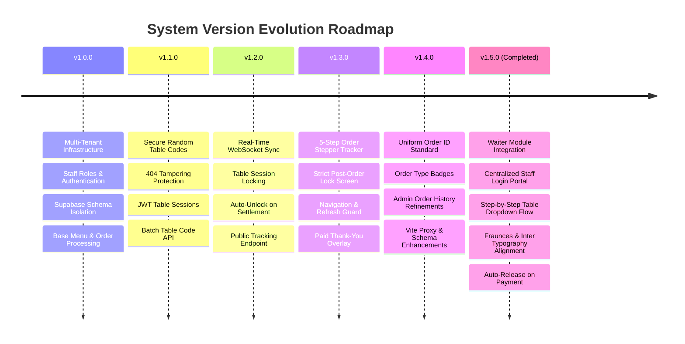

# Smart QR Ordering System — Complete System Specification & Version Changelog

This document provides a comprehensive overview of the architecture, database schema, security model, and complete version history for the **Smart QR Ordering System**, including the newly implemented **Waiter Module Integration (v1.5.0)**.

---

## 🏗️ System Architecture & Stack Overview

- **Frontend**: React (Vite, TailwindCSS, Lucide Icons, Sonner notifications) running on port `3006`.
- **Backend**: Node.js, Express, WebSockets (`ws`), Zod Validators, Brevo Email API running on port `3005`.
- **Database**: Supabase PostgreSQL with Schema-Based Multi-Tenancy (`tenant_<slug>`).
- **Authentication**: Centralized Staff Login Portal for all staff roles (Waiters, Kitchen Staff, Sales POS Staff) & Supabase Auth for Restaurant Admins.

---

## 📜 Version History & Feature Matrix



---

## 📋 Implementation Summary — Integrated Waiter Module (v1.5.0)

Implement a fully integrated, multi-tenant **Waiter Ordering Module** into the existing **Smart QR Ordering System**. The Waiter Module operates seamlessly alongside Customer QR Ordering, Kitchen KDS, and Seller POS without duplicating business logic, billing pipelines, or database architectures.

### Architecture Overview & Data Flow

```mermaid
flowchart TD
    subgraph CentralAuth["Centralized Staff Login Portal (/login or /r/:slug/login)"]
        CentralLogin["Single Login Portal for ALL Staff"]
    end

    subgraph Clients["Role-Based Operational Interfaces"]
        AdminView["1. Admin Panel (/admin)"]
        WaiterView["2. Waiter Dashboard & POS (/waiter-pos)"]
        CustomerView["3. Customer QR Menu / Tracker (/customer)"]
        KitchenView["4. Kitchen Display (/kitchen)"]
        PosView["5. Seller / POS Terminal (/pos)"]
    end

    subgraph Backend["Express & WebSocket Core (Port 3005)"]
        AuthMiddleware["Auth & RBAC Middleware"]
        TableSessionMgr["Waiter Session & Table State Mgr"]
        OrderPipeline["Unified Order Controller"]
        WSServer["Real-Time WebSocket Broadcast"]
    end

    subgraph Database["Supabase Tenant Schemas (tenant_<slug>)"]
        StaffTable["staff (role: waiter|sales_staff|kitchen_staff)"]
        SessionsTable["waiter_sessions"]
        OrdersTable["orders (order_source: waiter|qr|seller)"]
    end

    CentralLogin -->|role: kitchen_staff| KitchenView
    CentralLogin -->|role: sales_staff| PosView
    CentralLogin -->|role: waiter| WaiterView
    CentralLogin -->|role: admin| AdminView

    WaiterView -->|1. Start Table Session| TableSessionMgr
    WaiterView -->|2. Submit Order (source: waiter)| OrderPipeline
    CustomerView -->|3. Scan QR (Checks Active Session)| TableSessionMgr
    OrderPipeline -->|4. Store Order| OrdersTable
    OrderPipeline -->|5. Broadcast Update| WSServer
    WSServer -->|6. Live Sync| KitchenView
    WSServer -->|7. Live Sync| PosView
    WSServer -->|8. Live Sync| CustomerView
    PosView -->|9. Settle Bill & Close Session| TableSessionMgr
```

---

### Module Features Built

#### 1. Module 1: Waiter Management (Admin Panel)
- Added `waiter` role support in Admin Staff Credentials tab (`AdminView.jsx`) & [staffController.js](file:///c:/Users/ALI/OneDrive/Desktop/smart%20ordering%20system/backend/src/controllers/staffController.js).
- Created "Launch Waiter POS" shortcut button in Admin Terminal Launchpad.

#### 2. Module 2: Centralized Staff Authentication & Role Redirection
- **Single Centralized Login Portal**: ALL staff roles (`kitchen_staff`, `sales_staff`, `waiter`, `admin`) log in from the **same single login page** (`/login` or `/r/:restaurantSlug/login`).
- **Role-Based Dynamic Redirection**:
  - `kitchen_staff` → Kitchen KDS (`/kitchen`)
  - `sales_staff` → Seller POS (`/pos` or `/waiter`)
  - `waiter` → Waiter Table Dashboard & Tablet POS (`/waiter-pos`)
  - `admin` → Admin Dashboard (`/admin`)

#### 3. Module 3 & 4: Step-by-Step Flow & SaaS Design Tokens
- **Step 1 (First View on Screen)**: Prominent **Table Selection Dropdown** (`Table 1`, `Table 2`, `Table 3`...) with status tags (`🔴 Active Order`, `🟠 Waiter Serving`).
- **Step 2 (After Selecting Table)**: Clicking "Open Menu for Table X" opens the dedicated Menu & Cart ordering page for that table.
- **Typography & Aesthetics**: Aligned font families (`Fraunces` serif headings, `Inter` sans body) and color palette (`#171512`, `#7A2331` wine red accent, `#8A8580` muted text, `#EBE7E0` borders, `#F9F8F6` background) identically with `CustomerView.jsx`.

#### 4. Module 5 & 10: QR Scan Behavior & Customer Tracking Lock
- When a customer scans a QR code for a table occupied by a waiter session, backend returns `occupiedByWaiter: true`.
- Customer menu is locked and displays *"Your waiter [Name] is taking your order"*, preventing duplicate customer orders.

#### 5. Module 6 & 7: Waiter POS Tablet Interface & Order Pipeline
- Built [WaiterPosView.jsx](file:///c:/Users/ALI/OneDrive/Desktop/smart%20ordering%20system/frontend/src/views/WaiterPosView.jsx) with category sidebar, product grid, size variants, touch controls, special instructions, and order cart.
- Submits order through unified pipeline with `order_source: 'waiter'`.

#### 6. Module 8, 9 & 11: Kitchen KDS, POS Integration & Auto-Settlement
- Kitchen KDS ([KitchenOrderCard.jsx](file:///c:/Users/ALI/OneDrive/Desktop/smart%20ordering%20system/frontend/src/components/kitchen/KitchenOrderCard.jsx)) displays order source badges: `WAITER`, `SELLER`, `CUSTOMER QR`.
- When Seller processes payment in POS, `completeAndPayOrder` automatically closes the waiter session, unlocks the table, and resets customer QR state.

---

## 📁 Key File Locations

### Backend
- [api.js](file:///c:/Users/ALI/OneDrive/Desktop/smart%20ordering%20system/backend/src/routes/api.js): Central Express API router setup.
- [waiterSessionController.js](file:///c:/Users/ALI/OneDrive/Desktop/smart%20ordering%20system/backend/src/controllers/waiterSessionController.js): Waiter session start, list, and end endpoints.
- [WaiterSession.js](file:///c:/Users/ALI/OneDrive/Desktop/smart%20ordering%20system/backend/src/models/WaiterSession.js): Model for waiter table sessions.
- [orderController.js](file:///c:/Users/ALI/OneDrive/Desktop/smart%20ordering%20system/backend/src/controllers/orderController.js): Order creation & auto-close waiter session upon payment.

### Frontend
- [WaiterPosView.jsx](file:///c:/Users/ALI/OneDrive/Desktop/smart%20ordering%20system/frontend/src/views/WaiterPosView.jsx): Waiter Table Dropdown & Tablet POS screen.
- [App.jsx](file:///c:/Users/ALI/OneDrive/Desktop/smart%20ordering%20system/frontend/src/App.jsx): Centralized staff login routing for all staff roles.
- [KitchenOrderCard.jsx](file:///c:/Users/ALI/OneDrive/Desktop/smart%20ordering%20system/frontend/src/components/kitchen/KitchenOrderCard.jsx): KDS order source badges.
- [AdminView.jsx](file:///c:/Users/ALI/OneDrive/Desktop/smart%20ordering%20system/frontend/src/views/AdminView.jsx): Admin dashboard & staff creation with `waiter` role.
