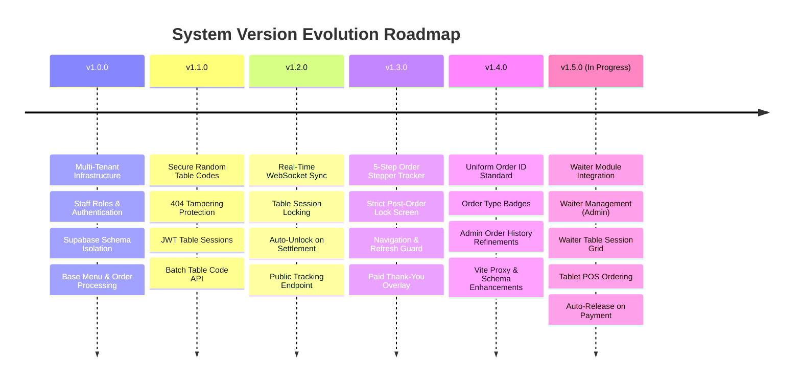

# Smart QR Ordering System — Complete System Specification & Version Changelog

This document provides a comprehensive overview of the architecture, database schema, security model, and complete version history for the **Smart QR Ordering System**, including the upcoming **Waiter Module Integration (v1.5.0)**.

---

## 🏗️ System Architecture & Stack Overview

- **Frontend**: React (Vite, TailwindCSS, Lucide Icons, Sonner notifications) running on port `3006`.
- **Backend**: Node.js, Express, WebSockets (`ws`), Zod Validators, Brevo Email API running on port `3005`.
- **Database**: Supabase PostgreSQL with Schema-Based Multi-Tenancy (`tenant_<slug>`).
- **Authentication**: JWT-based session tokens for Staff and Supabase Auth for Restaurant Admins & Super Admin.

---

## 📜 Version History & Feature Matrix



---

## 📋 Implementation Plan — Integrated Waiter Ordering Module (v1.5.0)

Implement a fully integrated, multi-tenant **Waiter Ordering Module** into the existing **Smart QR Ordering System**. The Waiter Module operates seamlessly alongside Customer QR Ordering, Kitchen KDS, and Seller POS without duplicating business logic, billing pipelines, or database architectures.

### Architecture Overview & Data Flow

```mermaid
flowchart TD
    subgraph Clients["5 Operational Interfaces"]
        AdminView["1. Admin Panel"]
        WaiterView["2. Waiter Dashboard & POS (New)"]
        CustomerView["3. Customer QR Menu / Tracker"]
        KitchenView["4. Kitchen Display (KDS)"]
        PosView["5. Seller / POS Terminal"]
    end

    subgraph Backend["Express & WebSocket Core (Port 3005)"]
        AuthMiddleware["Auth & RBAC Middleware"]
        TableSessionMgr["Waiter Session & Table State Mgr"]
        OrderPipeline["Unified Order Controller"]
        WSServer["Real-Time WebSocket Broadcast"]
    end

    subgraph Database["Supabase Tenant Schemas (tenant_<slug>)"]
        StaffTable["staff (role: waiter)"]
        SessionsTable["waiter_sessions"]
        OrdersTable["orders (order_source: waiter|qr|seller)"]
        RestaurantsTable["public.restaurants"]
    end

    WaiterView -->|1. Login & Token| AuthMiddleware
    WaiterView -->|2. Start Table Session| TableSessionMgr
    WaiterView -->|3. Submit Order (source: waiter)| OrderPipeline
    CustomerView -->|4. Scan QR (Checks Active Session)| TableSessionMgr
    OrderPipeline -->|5. Store Order| OrdersTable
    OrderPipeline -->|6. Broadcast Update| WSServer
    WSServer -->|7. Live Sync| KitchenView
    WSServer -->|8. Live Sync| PosView
    WSServer -->|9. Live Sync| CustomerView
    PosView -->|10. Settle Bill & Close Session| TableSessionMgr
```

---

### Module Specifications & Technical Changes

#### 1. Module 1: Waiter Management (Admin Panel)
- **File**: `AdminStaffTab.jsx` & `AdminView.jsx`
- **Features**:
  - Filter and manage staff accounts with `role: "waiter"`.
  - Create Waiter Account (`employeeCode`, `displayName`, `password`, `phone`, `employee_id`, `role: "waiter"`).
  - Edit waiter details, toggle Active/Inactive status, and reset passwords.
  - Display active table sessions currently assigned to each waiter.

#### 2. Module 2: Waiter Authentication & Role Protection
- **Backend File**: `auth.js` & `authController.js`
- **Features**:
  - Dedicated login payload at `/api/v1/auth/staff/login` with `role: "waiter"`.
  - Issued JWT contains: `{ staffId, restaurantId, restaurantSlug, role: "waiter" }`.
  - Protected API routes using `authorize('waiter')` or `authorize('admin', 'waiter')`.
  - Waiters are restricted from Admin analytics, platform settings, Super Admin APIs, and system configuration.

#### 3. Module 3 & 4: Waiter Table Dashboard & Session Management
- **New Controller File**: `waiterSessionController.js`
- **New Model File**: `WaiterSession.js`
- **Features**:
  - Color-coded Table Status Grid:
    - 🟢 **Available**: Unoccupied table ready for QR scanning or Waiter assignment.
    - 🟠 **Occupied by Waiter**: Waiter active session in progress.
    - 🔵 **Customer Ordering**: Self-ordering customer active.
    - 🟡 **Kitchen Preparing**: Order sent to kitchen.
    - 🟣 **Ready**: Food ready for serving.
    - 🔴 **Billing**: Bill printed/pending settlement.
  - "Start serving Table X?" modal triggers `POST /api/v1/waiter/sessions/start`.
  - Stores `waiter_id`, `table_id`, `restaurant_id`, `started_at`, `status: "active"`.

#### 4. Module 5 & 10: QR Scan Behavior & Customer Order Tracking
- **File**: `CustomerView.jsx` & `orderController.js`
- **Features**:
  - On QR scan (`GET /api/v1/orders/table-status/:table`), backend checks if an active `waiter_session` or active `order` exists.
  - **If Waiter Session Active**: Customer menu is locked. Customer is redirected to a live Tracking Page:
    - Displays: *"Your waiter [Waiter Name] is taking your order"*, Table Number, Order Status, and Item list.
    - Prevents customer duplicate ordering.
  - **If Available**: Shows standard Customer QR Ordering menu.

#### 5. Module 6 & 7: Waiter POS Ordering Interface & Submit Order
- **New View File**: `WaiterPosView.jsx`
- **Features**:
  - Tablet-optimized POS UI:
    - Left Column: Categories sidebar.
    - Center Grid: Menu item cards with photos, prices, size variants, and touch buttons.
    - Right Column: Live Cart drawer (items, quantities, size choices, special instructions, order notes).
  - Reuses `POST /api/v1/orders` with fields:
    - `order_source: "waiter"`
    - `waiter_id`: authenticated waiter ID
    - `session_id`: active waiter session ID
    - `table_name` / `table`: target table

#### 6. Module 8, 9 & 11: Kitchen, Seller/POS Integration & Auto-Settlement
- **Files**: `KitchenView.jsx`, `WaiterView.jsx` (Seller POS)
- **Features**:
  - **Kitchen KDS**: Displays order badge: `QR`, `WAITER`, or `SELLER`. Unified queue for all order sources.
  - **Seller POS**: Displays waiter name, table, items, and `WAITER` badge. Seller handles discount, tax, payment (`cash`/`card`), and bill printing.
  - **Auto-Session Release**: When Seller completes payment (`completeAndPayOrder`), the order status becomes `completed`, the active waiter session automatically ends, the table status returns to 🟢 **Available**, and the customer QR code unlocks for fresh orders.

#### 7. Module 12: Real-Time WebSocket Synchronization
- **File**: `server.js` & `socket.js`
- **Features**:
  - Broadcasts `WAITER_SESSION_STARTED`, `ORDER_CREATED`, `ORDER_UPDATED`, and `BILL_PAID` across all active clients (Waiter, Seller, Kitchen, Customer, Admin) in real-time.

---

### Database Changes (Supabase Schema)

#### 1. `waiter_sessions` Table (Added to `tenant_<slug>` schemas)
```sql
CREATE TABLE IF NOT EXISTS waiter_sessions (
  id UUID PRIMARY KEY DEFAULT gen_random_uuid(),
  waiter_id UUID NOT NULL,
  table_id VARCHAR(50) NOT NULL,
  restaurant_id UUID,
  started_at TIMESTAMP WITH TIME ZONE DEFAULT NOW(),
  ended_at TIMESTAMP WITH TIME ZONE,
  status VARCHAR(20) DEFAULT 'active', -- 'active' | 'closed'
  created_at TIMESTAMP WITH TIME ZONE DEFAULT NOW()
);
```

#### 2. `orders` Table Extensions
- `waiter_id` (UUID, nullable)
- `session_id` (UUID, nullable)
- `order_source` (VARCHAR(30) DEFAULT 'qr') -- `'qr'`, `'waiter'`, `'seller'`, `'takeaway'`, `'delivery'`

---

## 📁 Key File Locations

### Backend
- [api.js](file:///c:/Users/ALI/OneDrive/Desktop/smart%20ordering%20system/backend/src/routes/api.js): Central Express API router setup.
- [orderController.js](file:///c:/Users/ALI/OneDrive/Desktop/smart%20ordering%20system/backend/src/controllers/orderController.js): Order creation, table status checks, tracking, and settlement logic.
- [qrController.js](file:///c:/Users/ALI/OneDrive/Desktop/smart%20ordering%20system/backend/src/controllers/qrController.js): Table code generation, token resolution, and code reset endpoints.
- [tableCodeManager.js](file:///c:/Users/ALI/OneDrive/Desktop/smart%20ordering%20system/backend/src/utils/tableCodeManager.js): Random code generator and registry mapper.
- [supabase.js](file:///c:/Users/ALI/OneDrive/Desktop/smart%20ordering%20system/backend/src/utils/supabase.js): Tenant schema resolution & client cache.

### Frontend
- [CustomerView.jsx](file:///c:/Users/ALI/OneDrive/Desktop/smart%20ordering%20system/frontend/src/views/CustomerView.jsx): Customer QR ordering screen, session init, and order lock handling.
- [ActiveOrderTracker.jsx](file:///c:/Users/ALI/OneDrive/Desktop/smart%20ordering%20system/frontend/src/components/customer/ActiveOrderTracker.jsx): 5-step visual stepper timeline modal.
- [AdminView.jsx](file:///c:/Users/ALI/OneDrive/Desktop/smart%20ordering%20system/frontend/src/views/AdminView.jsx): Admin dashboard, order history table, menu manager, and QR stand generator.
- [WaiterView.jsx](file:///c:/Users/ALI/OneDrive/Desktop/smart%20ordering%20system/frontend/src/views/WaiterView.jsx): Waiter POS & table billing interface.
- [KitchenView.jsx](file:///c:/Users/ALI/OneDrive/Desktop/smart%20ordering%20system/frontend/src/views/KitchenView.jsx): Kitchen Display System (KDS) live order board.
