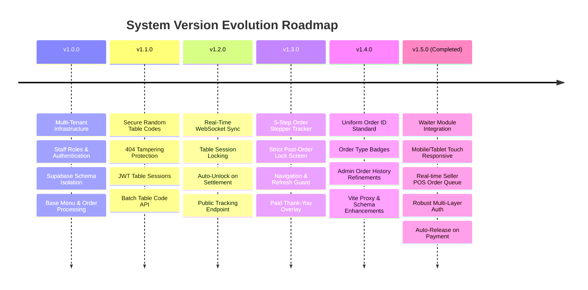
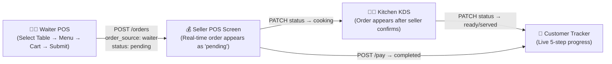
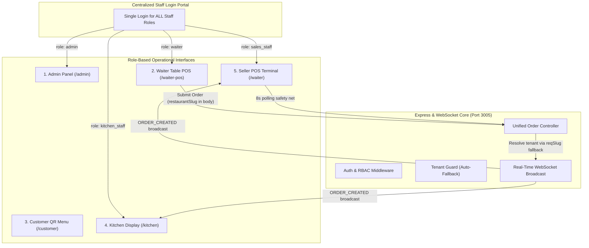

# Smart QR Ordering System — Complete System Specification & Version Changelog

This document provides a comprehensive overview of the architecture, database schema, security model, and complete version history for the **Smart QR Ordering System**, including the **Waiter Module Integration (v1.5.0)**.

---

## 🏗️ System Architecture & Stack Overview

- **Frontend**: React (Vite, TailwindCSS, Lucide Icons, Sonner notifications) running on port `3006`.
- **Backend**: Node.js, Express, WebSockets (`ws`), Zod Validators, Brevo Email API running on port `3005`.
- **Database**: Supabase PostgreSQL with Schema-Based Multi-Tenancy (`tenant_<slug>`).
- **Authentication**: Centralized Staff Login Portal for all staff roles (Waiters, Kitchen Staff, Sales POS Staff) & Supabase Auth for Restaurant Admins.

---

## 📜 Version History & Feature Matrix

---

## 📋 Implementation Summary — Integrated Waiter Module (v1.5.0)

### Order Flow Pipeline

### Key Bug Fixes in v1.5.0

| Issue | Root Cause | Fix | Commit |
|-------|-----------|-----|--------|
| `Role must be kitchen_staff, sales_staff or rider` | staffController.js hardcoded role array missing `waiter` | Added `waiter` to validation array | `026a310` |
| `403 Forbidden` on `/orders/active` | api.js `authorize()` missing `waiter` role | Added `waiter` to all order route authorizations | `f93d122` |
| Waiter login → wrong screen | LoginView.jsx redirected all non-kitchen staff to `/waiter` (seller route) | Added explicit `waiter` role → `/waiter-pos` redirect | `80b5088` |
| `403 Forbidden` on `/restaurants/settings` | Route only allowed `admin` role | Added `sales_staff`, `waiter`, `kitchen_staff` | `f44aa94` |
| `tenantGuard` 403 on staff requests | Missing `req.restaurantId`/`req.restaurantSlug` caused hard 403 | Added fallback auto-population from `req.user` | `0311770` |
| **Orders not appearing on Seller screen** | `restaurantParam` in `createOrder` never fell back to `req.body.restaurantSlug`, causing wrong tenant storage AND skipping WebSocket broadcast entirely | Added `|| reqSlug` fallback to `restaurantParam` resolution chain | `955ee36` |

### Architecture Overview

---

## 📁 Key File Locations

### Backend
- [orderController.js](file:///c:/Users/ALI/OneDrive/Desktop/smart%20ordering%20system/backend/src/controllers/orderController.js): Order creation with `reqSlug` fallback & WebSocket broadcast.
- [api.js](file:///c:/Users/ALI/OneDrive/Desktop/smart%20ordering%20system/backend/src/routes/api.js): Route authorization for all staff roles.
- [auth.js](file:///c:/Users/ALI/OneDrive/Desktop/smart%20ordering%20system/backend/src/middleware/auth.js): Multi-layer restaurant resolution for staff JWT tokens.
- [tenantGuard.js](file:///c:/Users/ALI/OneDrive/Desktop/smart%20ordering%20system/backend/src/middleware/tenantGuard.js): Auto-fallback tenant context for authenticated staff.
- [staffController.js](file:///c:/Users/ALI/OneDrive/Desktop/smart%20ordering%20system/backend/src/controllers/staffController.js): Staff creation with `waiter` role validation.
- [authController.js](file:///c:/Users/ALI/OneDrive/Desktop/smart%20ordering%20system/backend/src/controllers/authController.js): Staff JWT with `restaurantSlug` in token payload.

### Frontend
- [WaiterPosView.jsx](file:///c:/Users/ALI/OneDrive/Desktop/smart%20ordering%20system/frontend/src/views/WaiterPosView.jsx): Mobile/tablet touch-responsive Waiter POS with table dropdown, floating basket, cart modal.
- [WaiterView.jsx](file:///c:/Users/ALI/OneDrive/Desktop/smart%20ordering%20system/frontend/src/views/WaiterView.jsx): Seller POS with 8s polling + WebSocket real-time sync.
- [LoginView.jsx](file:///c:/Users/ALI/OneDrive/Desktop/smart%20ordering%20system/frontend/src/views/LoginView.jsx): Centralized staff login with role-based redirection.
- [App.jsx](file:///c:/Users/ALI/OneDrive/Desktop/smart%20ordering%20system/frontend/src/App.jsx): Route guards and authenticated role redirection.
