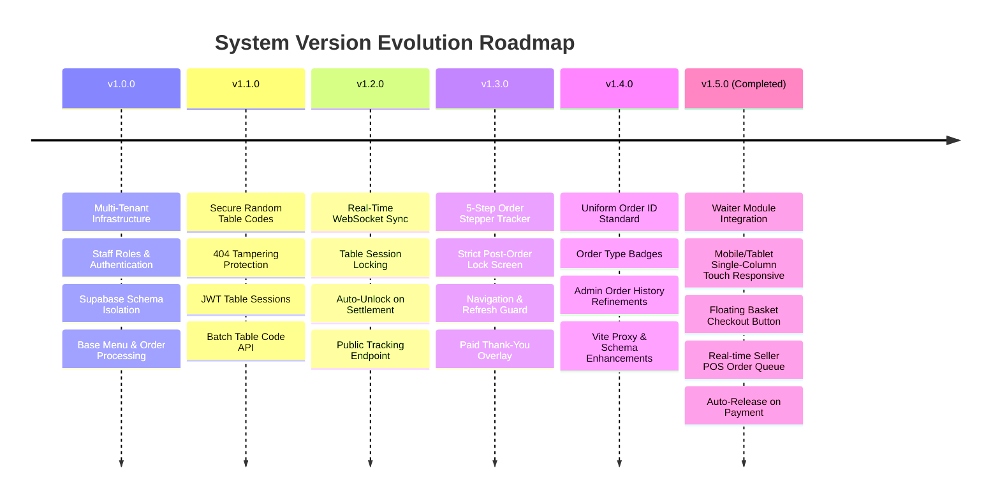

# Smart QR Ordering System — Complete System Specification & Version Changelog

This document provides a comprehensive overview of the architecture, database schema, security model, and complete version history for the **Smart QR Ordering System**, including the newly implemented **Waiter Module Integration (v1.5.0)**.

---

## 🏗️ System Architecture & Stack Overview

- **Frontend**: React (Vite, TailwindCSS, Lucide Icons, Sonner notifications) running on port `3006`.
- **Backend**: Node.js, Express, WebSockets (`ws`), Zod Validators, Brevo Email API running on port `3005`.
- **Database**: Supabase PostgreSQL with Schema-Based Multi-Tenancy (`tenant_<slug>`).
- **Authentication**: Centralized Staff Login Portal for all staff roles (Waiters, Kitchen Staff, Sales POS Staff) & Supabase Auth for Restaurant Admins.

---

## 📜 Version History & Feature Matrix



---

## 📋 Implementation Summary — Integrated Waiter Module (v1.5.0)

Implement a fully integrated, multi-tenant **Waiter Ordering Module** into the existing **Smart QR Ordering System**. The Waiter Module operates seamlessly alongside Customer QR Ordering, Kitchen KDS, and Seller POS without duplicating business logic, billing pipelines, or database architectures.

### Architecture Overview & Data Flow

```mermaid
flowchart TD
    subgraph CentralAuth["Centralized Staff Login Portal (/login or /r/:slug/login)"]
        CentralLogin["Single Login Portal for ALL Staff"]
    end

    subgraph Clients["Role-Based Operational Interfaces"]
        AdminView["1. Admin Panel (/admin)"]
        WaiterView["2. Waiter Dashboard & POS (/waiter-pos)"]
        CustomerView["3. Customer QR Menu / Tracker (/customer)"]
        KitchenView["4. Kitchen Display (/kitchen)"]
        PosView["5. Seller / POS Terminal (/pos)"]
    end

    subgraph Backend["Express & WebSocket Core (Port 3005)"]
        AuthMiddleware["Auth & RBAC Middleware"]
        TableSessionMgr["Waiter Session & Table State Mgr"]
        OrderPipeline["Unified Order Controller"]
        WSServer["Real-Time WebSocket Broadcast"]
    end

    subgraph Database["Supabase Tenant Schemas (tenant_<slug>)"]
        StaffTable["staff (role: waiter|sales_staff|kitchen_staff)"]
        SessionsTable["waiter_sessions"]
        OrdersTable["orders (order_source: waiter|qr|seller)"]
    end

    CentralLogin -->|role: kitchen_staff| KitchenView
    CentralLogin -->|role: sales_staff| PosView
    CentralLogin -->|role: waiter| WaiterView
    CentralLogin -->|role: admin| AdminView

    WaiterView -->|1. Start Table Session| TableSessionMgr
    WaiterView -->|2. Submit Order (status: pending)| OrderPipeline
    OrderPipeline -->|3. Broadcast Real-Time Update| WSServer
    WSServer -->|4. Real-Time Order Appears| PosView
    PosView -->|5. Confirm / Send to Kitchen| OrderPipeline
    OrderPipeline -->|6. Kitchen Broadcast| KitchenView
    PosView -->|7. Settle Bill & Close Session| TableSessionMgr
```

---

### Module Features Built

#### 1. Mobile & Tablet Touch Responsiveness
- Redesigned [WaiterPosView.jsx](file:///c:/Users/ALI/OneDrive/Desktop/smart%20ordering%20system/frontend/src/views/WaiterPosView.jsx) for mobile & tablet touch screens (`max-w-md` & `max-w-2xl` single-column layout).
- Large touch cards, touch buttons, and seamless vertical scrolling.

#### 2. Floating Basket Button & Cart Drawer Modal
- When items are added to cart, a bottom floating **"View Basket / Checkout (X items) - Rs Y.YY →"** button appears.
- Tapping the checkout button opens a slide-up **Cart Review Modal**, allowing waiters to modify item quantities, enter kitchen instructions, and submit the order.

#### 3. Real-Time Seller POS Order Routing
- Submitting a waiter order sends `status: 'pending'` immediately to the **Seller POS Screen** in real-time.
- The Seller reviews and confirms/sends the order, triggering its arrival in the **Kitchen KDS Display Screen**.

---

## 📁 Key File Locations

### Backend
- [api.js](file:///c:/Users/ALI/OneDrive/Desktop/smart%20ordering%20system/backend/src/routes/api.js): Central Express API router setup.
- [waiterSessionController.js](file:///c:/Users/ALI/OneDrive/Desktop/smart%20ordering%20system/backend/src/controllers/waiterSessionController.js): Waiter session start, list, and end endpoints.
- [WaiterSession.js](file:///c:/Users/ALI/OneDrive/Desktop/smart%20ordering%20system/backend/src/models/WaiterSession.js): Model for waiter table sessions.
- [orderController.js](file:///c:/Users/ALI/OneDrive/Desktop/smart%20ordering%20system/backend/src/controllers/orderController.js): Order creation & auto-close waiter session upon payment.

### Frontend
- [WaiterPosView.jsx](file:///c:/Users/ALI/OneDrive/Desktop/smart%20ordering%20system/frontend/src/views/WaiterPosView.jsx): Mobile/Tablet Waiter POS screen with floating checkout button.
- [App.jsx](file:///c:/Users/ALI/OneDrive/Desktop/smart%20ordering%20system/frontend/src/App.jsx): Centralized staff login routing for all staff roles.
- [KitchenOrderCard.jsx](file:///c:/Users/ALI/OneDrive/Desktop/smart%20ordering%20system/frontend/src/components/kitchen/KitchenOrderCard.jsx): KDS order source badges.
- [AdminView.jsx](file:///c:/Users/ALI/OneDrive/Desktop/smart%20ordering%20system/frontend/src/views/AdminView.jsx): Admin dashboard & staff creation with `waiter` role.
