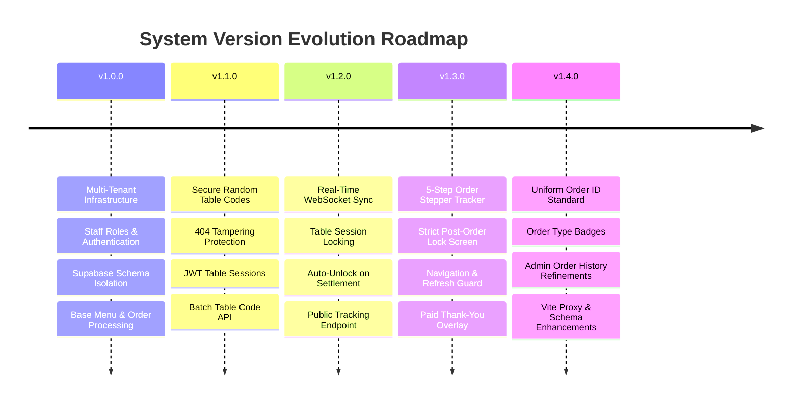

# Smart QR Ordering System — Complete System Specification & Version Changelog

This document provides a comprehensive overview of the architecture, database schema, security model, and complete version history for the **Smart QR Ordering System**.

---

## 🏗️ System Architecture & Stack Overview

- **Frontend**: React (Vite, TailwindCSS, Lucide Icons, Sonner notifications) running on port `3006`.
- **Backend**: Node.js, Express, WebSockets (`ws`), Zod Validators, Brevo Email API running on port `3005`.
- **Database**: Supabase PostgreSQL with Schema-Based Multi-Tenancy (`tenant_<slug>`).
- **Authentication**: JWT-based session tokens for Staff and Supabase Auth for Restaurant Admins & Super Admin.

---

## 📜 Version History & Feature Matrix

---

### 🚀 Version 1.0.0 — Multi-Tenant Core Architecture & Base Ordering

#### **Key Capabilities**
- **Multi-Tenant Schema Isolation**: Supported multi-tenant database partitioning. Each restaurant tenant operates under its dedicated PostgreSQL schema (e.g. `tenant_cheezious`, `tenant_gourmet_bistro_main`).
- **Dynamic Tenant Routing**: System routes API calls by tenant slug passed in the URL path (`/r/:restaurantSlug/...`), query parameters, or JWT claims.
- **Role-Based Access Control (RBAC)**:
  - `super_admin`: Platform Owner managing restaurant tenants, subscriptions, and global settings.
  - `admin`: Restaurant Owner managing staff, menu items, table counts, and sales analytics.
  - `kitchen_staff`: KDS interface to update live order status (`pending` → `confirmed` → `cooking` → `ready`).
  - `sales_staff`: POS terminal for counter orders (Takeaway, Delivery, Dine-In).
  - `customer`: Public browser view for menu browsing and cart checkout.
- **Server Resilience & Monitoring**: Added DNS IPv4 prioritization, Brevo SMTP fallback, and light UptimeRobot health check endpoints (`/health`, `/api/v1/health`).

---

### 🔒 Version 1.1.0 — Secure Random Table Codes & URL Tamper Protection

#### **Problem Addressed**
Previously, QR codes used sequential numeric table parameters (`?table=1`, `?table=2`). Customers could tamper with the URL query parameter to place orders on other tables.

#### **Key Capabilities**
- **6-Character Random Table Codes**: Replaced sequential table numbers with non-guessable 6-character alphanumeric codes (`?table=X9QK72`, `?table=AF93DK`), filtering out ambiguous characters (`0`, `O`, `1`, `I`).
- **Automatic 404 Resolution Guard**: Requesting invalid or unassigned table codes returns `404 Access Denied`, preventing unauthorized menu/table access.
- **Signed Table Session JWTs**: Upon QR verification, backend issues a signed JWT token bound to the table identity.
- **Batch Table Code Endpoint (`GET /api/v1/qr/tables`)**: Allows the Admin panel to load table codes efficiently in one API request.
- **Single-Table Code Regeneration**: Admins can reset a table's code on demand with a confirmation warning modal, invalidating stolen or compromised physical QR stands.

---

### ⚡ Version 1.2.0 — Real-Time WebSocket Sync & Table Session Locking

#### **Key Capabilities**
- **Table Session Lock (`TableOccupiedOverlay.jsx`)**: When a customer is actively dining at Table X with an unpaid order, scanning Table X's QR code on another device displays a session lock screen.
- **WebSocket Synchronization (`server.js` & `socket.js`)**: Backend broadcasts real-time `ORDER_UPDATED` events to all clients registered to the restaurant channel (`realTimeSync.registerRestaurant`).
- **Auto-Unlock on Payment**: Completing and settling a table bill (`completeAndPayOrder`) automatically regenerates the table code and sends a WebSocket message unlocking the table for new guests.
- **Public Order Tracking (`GET /api/v1/orders/track/:id`)**: Enables token-less order status polling for customer devices after page reloads.

---

### 🎨 Version 1.3.0 — Customer Stepper Tracker & Strict Order Lock

#### **Key Capabilities**
- **5-Step Order Stepper Tracker (`ActiveOrderTracker.jsx`)**: Reintroduced a visual status stepper modal tracking order progression:
  1. `Order Placed`: Order submitted to kitchen.
  2. `Confirmed`: Accepted by kitchen.
  3. `Preparing`: Chef is cooking.
  4. `Ready`: Order is ready for table pickup/delivery.
  5. `Served`: Delivered to customer.
- **Strict Customer Order Lock**: Once an order is placed, the menu grid and cart drawer are hidden, replaced by the order tracker overlay. Customers cannot modify items or add extra items until the current order is settled.
- **Refresh & Navigation Guard**: Attached `beforeunload` event handler and `popstate` history push to prevent accidental tab closing or back button navigation during active orders.
- **Thank-You Screen (`PaidThankYouOverlay.jsx`)**: Automatically triggers a thank-you screen when an order is completed, before resetting state for the next session.

---

### 🧹 Version 1.4.0 — Uniform Order IDs & Admin UI Refinements

#### **Key Capabilities**
- **Standardized Order ID Format**: Replaced raw database UUID strings across all views with formatted, user-friendly invoice numbers (`INV-YYYYMMDD-001`) via `formatOrderId`.
- **Admin Order History Clean-Up**:
  - Replaced duplicate `Table Table X` string clutter with clean **Order Type** badges (`Takeaway`, `Delivery`, `Dine-In`).
  - Added receipt timestamp formatting (`formatReceiptDate`).
  - Removed redundant `Items` column from the Admin Order History table as requested.
- **Validation & Proxy Enhancements**: Added `.passthrough()` to Zod order schemas in `order.schemas.js` and added API proxying in `vite.config.js`.

---

## 📁 Key File Locations

### Backend
- [api.js](file:///c:/Users/ALI/OneDrive/Desktop/smart%20ordering%20system/backend/src/routes/api.js): Central Express API router setup.
- [orderController.js](file:///c:/Users/ALI/OneDrive/Desktop/smart%20ordering%20system/backend/src/controllers/orderController.js): Order creation, table status checks, tracking, and settlement logic.
- [qrController.js](file:///c:/Users/ALI/OneDrive/Desktop/smart%20ordering%20system/backend/src/controllers/qrController.js): Table code generation, token resolution, and code reset endpoints.
- [tableCodeManager.js](file:///c:/Users/ALI/OneDrive/Desktop/smart%20ordering%20system/backend/src/utils/tableCodeManager.js): Random code generator and registry mapper.
- [supabase.js](file:///c:/Users/ALI/OneDrive/Desktop/smart%20ordering%20system/backend/src/utils/supabase.js): Tenant schema resolution & client cache.

### Frontend
- [CustomerView.jsx](file:///c:/Users/ALI/OneDrive/Desktop/smart%20ordering%20system/frontend/src/views/CustomerView.jsx): Customer QR ordering screen, session init, and order lock handling.
- [ActiveOrderTracker.jsx](file:///c:/Users/ALI/OneDrive/Desktop/smart%20ordering%20system/frontend/src/components/customer/ActiveOrderTracker.jsx): 5-step visual stepper timeline modal.
- [AdminView.jsx](file:///c:/Users/ALI/OneDrive/Desktop/smart%20ordering%20system/frontend/src/views/AdminView.jsx): Admin dashboard, order history table, menu manager, and QR stand generator.
- [WaiterView.jsx](file:///c:/Users/ALI/OneDrive/Desktop/smart%20ordering%20system/frontend/src/views/WaiterView.jsx): Waiter POS & table billing interface.
- [KitchenView.jsx](file:///c:/Users/ALI/OneDrive/Desktop/smart%20ordering%20system/frontend/src/views/KitchenView.jsx): Kitchen Display System (KDS) live order board.
